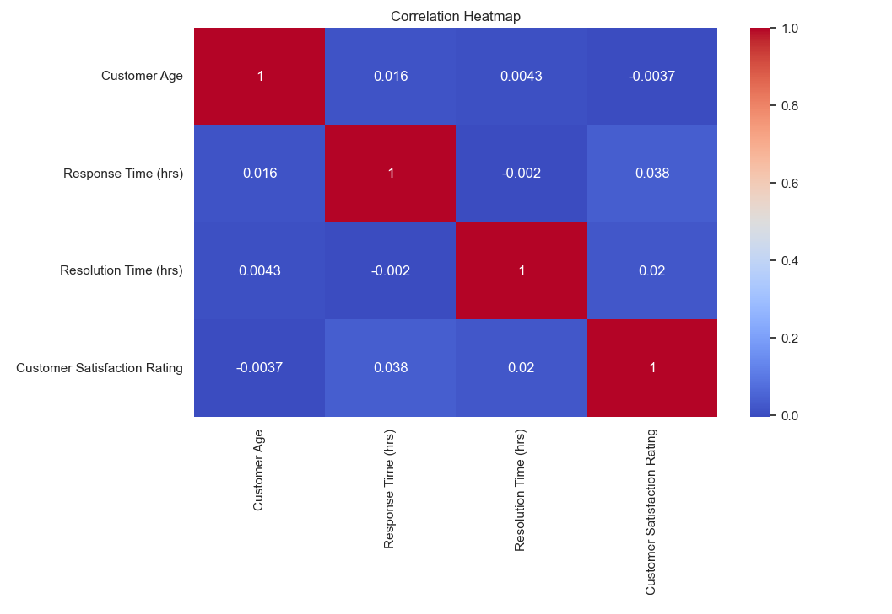
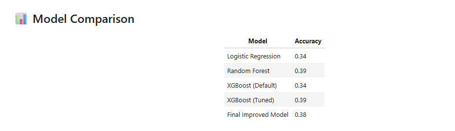
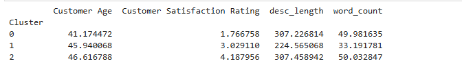

# 🚀 Customer Support Analytics & Insights Dashboard

## 📌 Project Overview

This project focuses on analyzing customer support data to uncover insights about customer satisfaction, issue patterns, and risk behavior. It combines **Machine Learning, NLP, and Power BI** to deliver both predictive insights and interactive dashboards.

---

## 🎯 Business Problem

Customer support teams often struggle to:

* Identify dissatisfied customers early
* Understand common issue trends
* Prioritize high-risk tickets

This project solves that by providing **data-driven insights and visual analytics** to improve decision-making.

---

## 📊 Dataset Description

The dataset contains customer support interactions with features such as:

* Customer Satisfaction Rating
* Product Category
* Ticket Type
* Customer Feedback (text data)
* Issue Description

---

## ⚙️ Key Features

### 🔹 1. Exploratory Data Analysis (EDA)

* Distribution of customer satisfaction
* Product-wise ticket trends
* Correlation analysis

---

### 🔹 2. NLP & Sentiment Analysis

* Text preprocessing (cleaning, tokenization, lemmatization)
* Sentiment classification using TextBlob
* Identification of negative feedback patterns

---

### 🔹 3. Customer Segmentation (Clustering)

* Applied KMeans clustering
* Grouped customers based on behavior
* Identified high-risk customer segments

---

### 🔹 4. Machine Learning

* Logistic Regression model
* Predict customer satisfaction
* Model evaluation using accuracy and confusion matrix

---

### 🔹 5. Interactive Dashboard (Power BI)

* KPI metrics for customer satisfaction
* Product-wise and ticket-type analysis
* Sentiment distribution
* Cluster-based insights

---

## 📸 Dashboard Preview

### 🟦 Overview Dashboard


---

### 🟪 NLP & Issue Analysis


---

### 🟩 Customer Segmentation


---

## 📊 Model & Data Insights 

### 🔥 Correlation Heatmap


### 🤖 Model Performance Comparison


### 🧩 Customer Clustering Insights



## 📈 Key Insights

* Customers with longer complaints tend to have lower satisfaction
* Negative sentiment strongly correlates with low ratings
* Certain product categories generate more support tickets
* Clustering reveals distinct high-risk customer groups

---

## 🛠️ Tech Stack

* Python (Pandas, NumPy)
* Visualization (Matplotlib, Seaborn)
* Machine Learning (Scikit-learn, XGBoost)
* NLP (NLTK, TextBlob)
* Dashboarding (Power BI)

---

## 📂 Project Structure

```
customer-support-analytics/
│
├── data/
├── notebooks/
├── dashboard/
├── images/
├── reports/
├── requirements.txt
└── README.md
```

---

## ▶️ How to Run

1. Clone the repository
2. Install dependencies:

   ```
   pip install -r requirements.txt
   ```
3. Run the notebook:

   ```
   jupyter notebook notebooks/analysis.ipynb
   ```

---

## 🧠 Future Improvements

* Deploy ML model using Flask/Streamlit
* Real-time dashboard integration
* Advanced NLP using transformers

---

## ⭐ Conclusion

This project demonstrates how combining **data analysis, NLP, and machine learning** can provide actionable insights to improve customer support systems and enhance user satisfaction.

---

